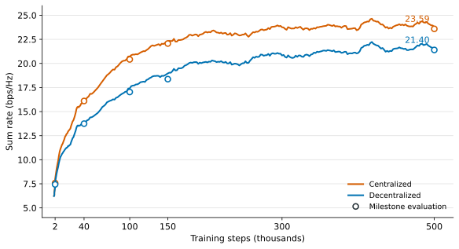
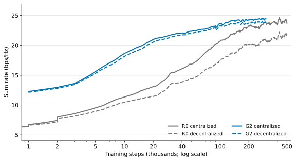

# Decentralized RIS Inference: Problems, Solutions, and Current Results

The current work builds on previous work by former RAs. That work studied a cell-free system, a promising alternative to conventional cellular architectures. However, exchanging channel state information (CSI) between access points (APs) and the central processing unit (CPU), and distributing beamforming solutions, create substantial overhead. The prior work proposed a graph neural network (GNN)-based model that jointly optimizes AP beamforming and reconfigurable intelligent surface (RIS) configurations in multi-RIS-assisted cell-free networks. It uses centralized training and decentralized inference: the same trained model is distributed to the APs, where each copy computes local beamforming and RIS phase proposals. The CPU then aggregates the phase proposals to determine the final RIS configuration. Building on this approach, the current work asks whether signaling overhead can be further reduced while retaining performance close to centralized inference.

The main setting has $M=2$ antennas per AP and $N=30$ reflecting elements per RIS, with four RISs, eight UEs, and a maximum transmit power of 15 dBm per AP.

**R0 stands for the original paper method and G2 is my latest proposed method**

## 1. R0 training was slow, and 2k steps were insufficient

### 1.1 Training speed

**Solution.** We vectorized R0 across samples and nodes.

**Result.** In a matched short benchmark, the new implementation was 5.15× faster while producing numerically equivalent outputs.

| R0 implementation | Hardware | Batch size | Estimated time per 1,000 steps | Relative speed |
|---|---|---:|---:|---:|
| Legacy per-sample/per-node processing | RTX 5090 | 8 | 595.5 s | 1.00× |
| Current batched processing | RTX 5090 | 8 | 115.7 s | **5.15×** |

*Table 1.* Estimated R0 training time on an RTX 5090 (E01).

### 1.2 Effect of longer training

To determine whether the 2k-step budget was sufficient, we continued training R0 to 500k steps.

*Figure 1.* Centralized and decentralized R0 sum rates during training with continuous RIS phases. Lines show smoothed validation results; markers show evaluations at five checkpoints.

**Comparison with the original paper.** The original paper reported that decentralized inference nearly matched centralized inference after 2k training steps. We observe a similarly small centralized–decentralized gap at 2k steps: 7.581 versus 7.436 bps/Hz. At 500k steps, however, the corresponding rates increase to 23.590 and 21.399 bps/Hz, and the gap becomes larger.

## 2. R0 could send less data

Let $L$, $R$, $K$, and $N$ be the numbers of APs, RISs, UEs, and elements per RIS; $l$, $r$, $k$, and $n$ index them. The GNN has $D$ layers with $q$ hidden features per layer. For AP $l$, $\mathbf s_{l,r}^{(D)}\in\mathbb R^{q(D+1)}$ is its final RIS node state for RIS $r$. The vector $\mathbf e_l\in\mathbb R^{RK}$ collects AP–RIS–UE channel energies, with entry $e(l,r,k)=\operatorname{tr}(\mathbf H_{l,r,k}^{T}\mathbf H_{l,r,k}^{*})$ for the corresponding channel matrix $\mathbf H_{l,r,k}$.

**Problem.** To produce the AP-to-CPU message, AP $l$ uses a trainable RIS readout layer:

$$
f_{\mathrm{RIS},l}^{\mathrm{out}}:
\mathbb R^{q(D+1)}\times\mathbb R^{RK}\rightarrow\mathbb R^{4N}.
$$

$$
\mathbf v_{l,r}
=
f_{\mathrm{RIS},l}^{\mathrm{out}}
(\mathbf s_{l,r}^{(D)},\mathbf e_l)
=
\begin{bmatrix}
\mathbf W_1\mathbf s_{l,r}^{(D)}+\mathbf b_1\\
\mathbf W_2\mathbf e_l+\mathbf b_2
\end{bmatrix}
\in\mathbb R^{4N}.
$$

Here $\mathbf W_1$, $\mathbf W_2$, $\mathbf b_1$, and $\mathbf b_2$ are learned parameters. The output contains $4N$ values, corresponding to 120 values per AP–RIS pair when $N=30$.

Each AP sends $\mathbf v_{l,r}$ to the CPU. For each RIS $r$, the CPU sums these messages and applies the learned reduction matrix $\mathbf W_{\mathrm{reduce}}\in\mathbb R^{2N\times4N}$ and bias $\mathbf b\in\mathbb R^{2N}$:

$$
\mathbf W_{\mathrm{reduce}}\sum_{l=1}^{L}\mathbf v_{l,r}+\mathbf b\in\mathbb R^{2N}.
$$

The first $N$ and last $N$ outputs provide the two coordinates of $N$ phase vectors. Their angles are the final RIS phases.

**Solution.** Move the learned reduction to each AP and send phase angles with one magnitude weight.

**Algorithm 1. Magnitude-weighted message and aggregation**

**Input:** AP-local RIS node states $\mathbf s_{l,r}^{(D)}$, energy vectors $\mathbf e_l$, and trained readout and reduction parameters.

**Output:** Final RIS phase angles $\theta_{r,n}$.

1. At each AP $l$ and for each RIS $r$, compute $\mathbf v_{l,r}$ and apply the learned reduction:
   $$
   \mathbf W_{\mathrm{reduce}}\mathbf v_{l,r}+\mathbf b/L\in\mathbb R^{2N}.
   $$
   The first $N$ and last $N$ outputs provide the two coordinates of one vector for each RIS element.
2. Use each vector's angle as the phase proposal $\phi_{l,r,n}$, and use the mean Euclidean norm of the $N$ vectors as the AP–RIS weight $s_{l,r}$.
3. Send $\phi_{l,r,1},\ldots,\phi_{l,r,N}$ and $s_{l,r}$ to the CPU.
4. For each RIS element, compute
   $$
   \theta_{r,n}
   =\operatorname{angle}\left(
   \sum_{l=1}^{L}s_{l,r}
   \begin{bmatrix}
   \cos\phi_{l,r,n}\\
   \sin\phi_{l,r,n}
   \end{bmatrix}
   \right).
   $$

Therefore, each AP sends $N+1$ scalars per RIS instead of the original $4N$ values.

The term $\mathbf b/L$ makes the AP-side reductions sum to R0's CPU reduction before their angles are taken. For comparison, equal weighting uses the same phase proposals but sets $s_{l,r}=1$ for every AP–RIS pair.

| Message and fusion | Scalars sent per AP–RIS pair | Centralized sum rate (bps/Hz) | Decentralized sum rate (bps/Hz) |
|---|---:|---:|---:|
| Original R0 | 120 | 23.5856 | 21.3812 |
| Phases, equal weights | 30 | 23.5940 | 16.9721 |
| Phases, mean-magnitude weight | 31 | 23.5826 | 21.4231 |

*Table 2.* Fixed R0 checkpoint after 500k training steps. All methods are evaluated on the same 3,200 channel samples.

**Result.** The $N+1=31$-scalar message preserves the decentralized rate of the original R0, whereas equal weighting reduces it by 4.4092 bps/Hz.

## 3. Use local channel energy as the aggregation weight

**Problem.** The aggregation weight in Section 2 comes from the model output. Can a weight computed directly from each AP’s local channels work better?

**Solution.** For AP $l$ and RIS $r$, let $\mathcal K_l$ be the users served by AP $l$. Use

$$
E_{l,r}=\sum_{k\in\mathcal K_l}e(l,r,k),
\qquad
\theta_{r,n}
=\operatorname{angle}\left(
\sum_{l=1}^{L}E_{l,r}
\begin{bmatrix}
\cos\phi_{l,r,n}\\
\sin\phi_{l,r,n}
\end{bmatrix}
\right).
$$

Each AP still sends $N$ phase angles and one scalar $E_{l,r}$ per RIS. The CPU aggregates them without trainable parameters.

The three aggregation rules use the same beamformer and phase proposals. Equal weighting uses weight $1$, output-magnitude weighting uses $s_{l,r}$ from Section 2, and local-energy weighting uses $E_{l,r}$.

| Aggregation weight | Centralized sum rate (bps/Hz) | Decentralized sum rate (bps/Hz) |
|---|---:|---:|
| Equal | 23.7341 | 17.1888 |
| Output magnitude | 23.7341 | 21.5980 |
| Local channel energy | 23.7341 | **23.2173** |

*Table 3.* Fixed R0 checkpoint after 500k training steps. All methods use the same 3,200 channel samples, with centralized R0 as the common reference.

**Result.** Local energy improves decentralized sum rate over output magnitude by 1.6194 bps/Hz. This fixed-checkpoint result motivates training with the energy rule in Section 4.

## 4. Improve how the graph represents channels

### 4.1 Graph representation

The original paper uses $LK$ AP–UE nodes and $R$ RIS nodes, and recurrently updates both types of node states. G2 removes the RIS node states and encodes every RIS–AP–UE tuple $(r,i)$ as a link embedding $\mathbf z_{r,i}^{(0)}$. Table 4 summarizes the modification we made.

| Component | R0 | G2 |
|---|---|---|
| States across layers | AP–UE node states $\mathbf u_i^{(d)}$ and RIS node states $\mathbf s_r^{(d)}$ are updated | Only AP–UE node states $\mathbf u_i^{(d)}$ are updated; link embeddings $\mathbf z_{r,i}^{(0)}$ remain fixed |
| AP–UE node initialization | Mean pooling of the $R$ encoded CSI vectors | Mean/max pooling of the $R$ link embeddings $\mathbf z_{r,i}^{(0)}$ |
| RIS node initialization | Two sums of the initial AP–UE node states, weighted separately by $\widehat e^{\mathrm{node}}_{r,i}$ and $\widehat a_i$ | N/A |
| AP–UE node update | Other-node max pooling and an $\widehat e^{\mathrm{RIS}}_{i,r}$-weighted sum of the RIS node states | Other-node max pooling and an $\widehat e^{\mathrm{RIS}}_{i,r}$-weighted sum of the link embeddings $\mathbf z_{r,i}^{(0)}$ |
| RIS node update | Two sums of the AP–UE node states, weighted separately by $\widehat e^{\mathrm{node}}_{r,i}$ and $\widehat a_i$ | N/A |
| Beamforming readout | From $\mathbf u_i^{(D)}$ | Same |
| RIS readout and aggregation | $\mathbf s_r^{(D)}\rightarrow 4N$ values $\rightarrow$ learned CPU reduction | $(\mathbf z_{r,i}^{(0)},\mathbf u_i^{(D)})\rightarrow N$ local phase angles plus one local channel energy $E_{l,r}$ $\rightarrow$ energy-weighted CPU aggregation |

*Table 4.* Comparison between R0 and G2.

### 4.2 Link encoding and node initialization

Let $\mathcal I= \{i=(l,k):1\le l\le L,\;1\le k\le K\}$ denote the AP–UE node set. Following the original paper, we describe the local CSI acquisition for node $i=(l,k)$ and RIS $r$ as

$$
\widetilde{\mathbf H}_{(l,r,k)}
=
[\mathbf H_{l,r,k}^{T},\mathbf h_{D,(l,k)}^{T}]
\in\mathbb C^{M\times(N+1)},
$$

$$
\widetilde{\mathbf h}_{r,i}
\equiv
\widetilde{\mathbf h}_{(l,r,k)}
=
\begin{bmatrix}
\operatorname{Re}\{\operatorname{vec}(\widetilde{\mathbf H}_{(l,r,k)})\}\\
\operatorname{Im}\{\operatorname{vec}(\widetilde{\mathbf H}_{(l,r,k)})\}
\end{bmatrix}
\in\mathbb R^{2M(N+1)}.
$$

The cascaded- and direct-link energy weights are

$$
e_{r,i}
\equiv e(l,r,k)
=
\operatorname{tr}\!\left(
\mathbf H_{l,r,k}^{T}\mathbf H_{l,r,k}^{*}
\right),
\qquad
a_i
\equiv a(l,k)
=
\mathbf h_{D,(l,k)}\mathbf h_{D,(l,k)}^{H}.
$$

The energy features are normalized as

$$
\widehat e^{\mathrm{node}}_{r,i}
=
\frac{e_{r,i}}{\sum_{j\in\mathcal I}e_{r,j}},
\qquad
\widehat e^{\mathrm{RIS}}_{i,r}
=
\frac{e_{r,i}}{\sum_{s=1}^{R}e_{s,i}},
\qquad
\widehat a_i
=
\frac{a_i}{\sum_{j\in\mathcal I}a_j}.
$$

These quantities measure the relative importance of an AP–UE node to a RIS, a RIS to an AP–UE node, and a direct link among all AP–UE nodes, respectively.

A shared encoder combines the CSI and the three normalized energy features:

$$
\mathbf z_{r,i}^{(0)}
=
f_{\mathrm{link}}\!\left(
\left[
\widetilde{\mathbf h}_{r,i};
\widehat e^{\mathrm{node}}_{r,i};
\widehat e^{\mathrm{RIS}}_{i,r};
\widehat a_i
\right]
\right)
\in\mathbb R^q.
$$

Without standalone RIS nodes, G2 initializes each AP–UE node state by pooling its $R$ link embeddings:

$$
\mathbf u_i^{(0)}
=
f_{\mathrm{pool}}\!\left(
\begin{bmatrix}
\operatorname*{mean}_{1\le r\le R}\mathbf z_{r,i}^{(0)}\\
\operatorname*{max}_{1\le r\le R}\mathbf z_{r,i}^{(0)}
\end{bmatrix}
\right)
\in\mathbb R^q.
$$

Mean/max pooling captures both aggregate and dominant link features across RISs.

The link encoder $f_{\mathrm{link}}$ and the update functions $f^{(d)}$ are trainable two-layer MLPs with Leaky ReLU activation, whereas $f_{\mathrm{pool}}$ is a trainable linear projection. The phase head introduced in Section 4.3 is also trainable and is shared across APs and RISs. Different update layers have independent parameters. All trainable parameters are jointly optimized using the sum-rate objective during centralized training.

### 4.3 Message passing and readout

**Message passing.** For each AP–UE node $i$, $\mathbf c_i$ is computed from its link embeddings and reuses it at every update layer. In $\mathbf m_i^{(d-1)}$, each AP–UE node-state feature is maximized independently across the other nodes.

$$
\mathbf m_i^{(d-1)}=
\max_{j\in\mathcal I,\,j\ne i}\mathbf u_j^{(d-1)},
\qquad
\mathbf c_i=\sum_{r=1}^{R}\widehat e^{\mathrm{RIS}}_{i,r}\mathbf z_{r,i}^{(0)},
$$

$$
\mathbf u_i^{(d)}
=
[f^{(d)}([\mathbf u_i^{(d-1)};\mathbf m_i^{(d-1)};\mathbf c_i]);
\mathbf u_i^{(d-1)}],
\qquad d=1,\ldots,D.
$$

In $\mathbf u_i^{(d)}$, the newly computed features are concatenated with the previous AP–UE node state.

**Readout.** The beamforming readout is unchanged from R0. For RIS prediction, a shared phase head combines each link embedding with its corresponding final AP–UE node state and pools the resulting features over the users served by AP $l$:

$$
\mathbf t_{r,(l,k)}
=
f_{\mathrm{phase}}
([\mathbf z_{r,(l,k)}^{(0)};\mathbf u_{(l,k)}^{(D)}])
\in\mathbb R^q,
$$

$$
\boldsymbol\phi_{l,r}
=
f_{\mathrm{out}}
\left(
\left[
\operatorname*{mean}_{k\in\mathcal K_l}\mathbf t_{r,(l,k)};
\max_{k\in\mathcal K_l}\mathbf t_{r,(l,k)}
\right]
\right)
\in[-\pi,\pi)^N.
$$

During decentralized inference, AP $l$ evaluates G2 on its local graph view and sends
$\boldsymbol\phi_{l,r}$ and $E_{l,r}$ to the CPU for the energy-weighted aggregation
in Section 3. Centralized inference evaluates the same network on the global graph.

### 4.4 Results

| Model | Training steps | Centralized sum rate (bps/Hz) | Decentralized sum rate (bps/Hz) |
|---|---|---:|---:|
| R0 | 500k | 24.9522 | 22.3305 |
| G2 | 300k | 25.5478 | **24.6898** |

*Table 5.* Last-checkpoint comparison on the same 400 channel samples.

**Result.** On the common evaluation set, G2-300k exceeds R0-500k by 2.3593 bps/Hz in decentralized inference.

*Figure 2.* Centralized and decentralized validation sum rates during training. The R0 and G2 curves end at their last available checkpoints, 500k and 300k steps, respectively.

## Conclusion

Details: [R0 training (E01)](./experiments/e01_baseline_training.md), [message interface (E04)](./experiments/e04_action_interfaces.md), [local-energy fusion (E05)](./experiments/e05_energy_consensus.md), [graph comparison (E06)](./experiments/e06_graph_energy_training.md), and [method definitions](./decentralized_ris_methods.md).
